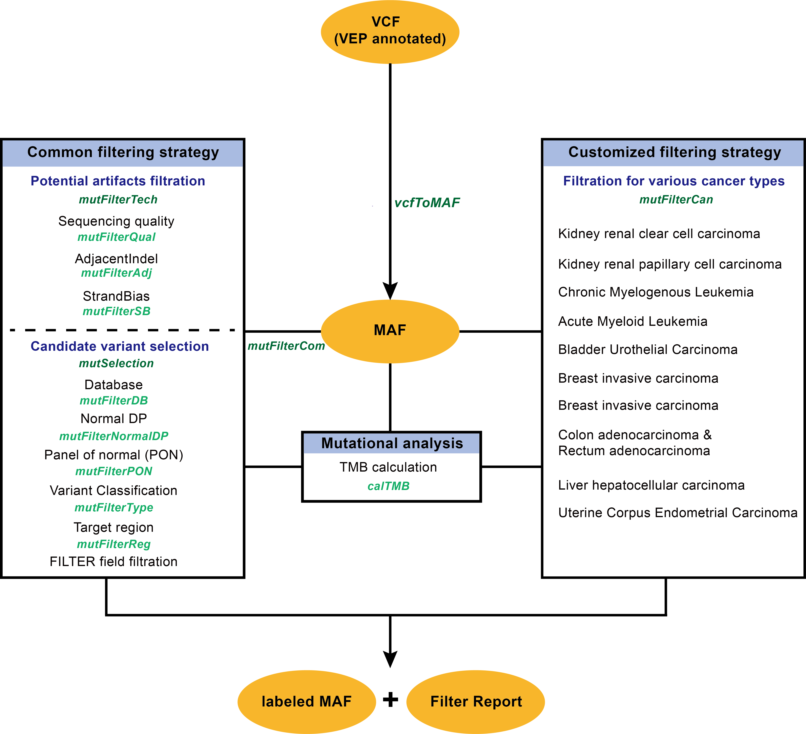
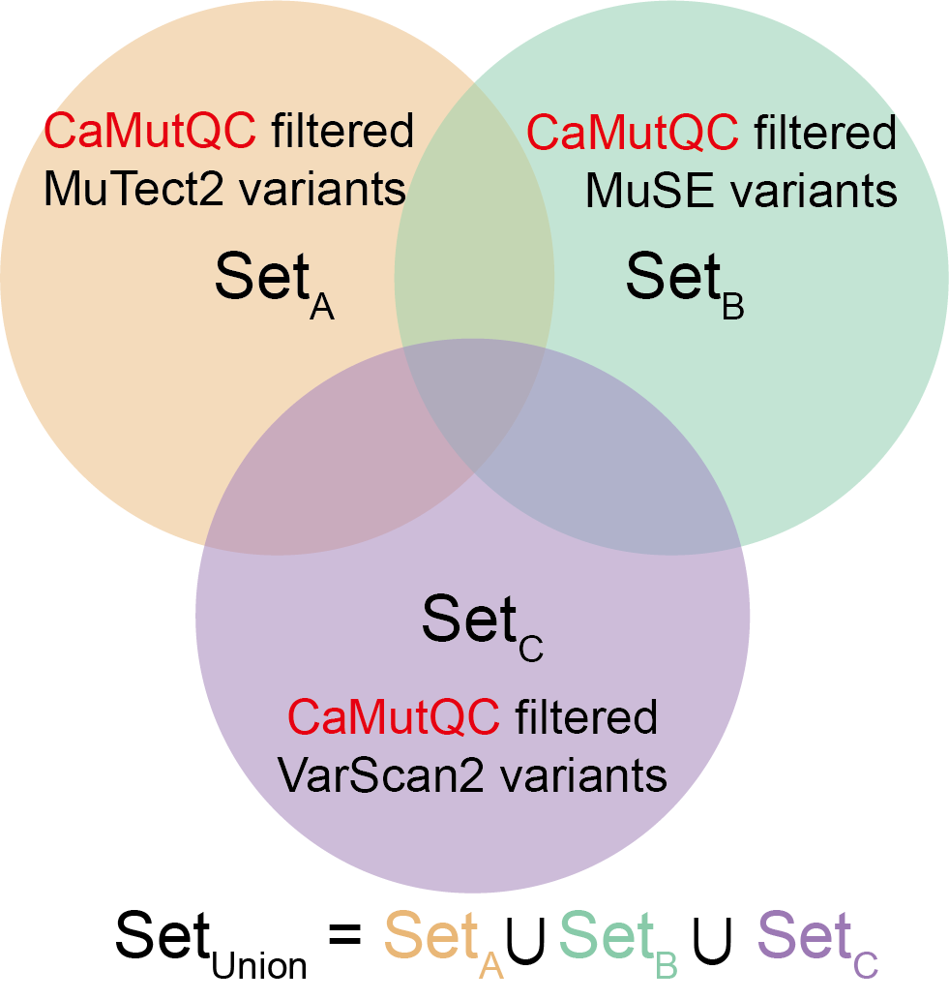

<style type="text/css">
  body{
  font-size: 11pt;
}
  h1.title {
  color: #2D84DE;
  font-size: 22pt;
  font-weight: bold;
}
  h2 {
  color: #D96115;
  font-size: 18pt;
  font-weight: bold;
}
  h3 {
  color: #EB7A32;
  font-size: 15pt;
}
  h4 {
  color: #EB7A32;
  font-size: 13pt;
}
  #TOC {
  font-size: 8pt;
}
  #TOC li:before {
  counter-increment: none;
}
</style>


## Introduction 

The quality control of cancer somatic mutations is of great significance in cancer genomics. It helps to eliminate false positive mutations arisen during the sequencing process, thereby improving the efficiency and accuracy of downstream analysis. Here, we developed an R package CaMutQC, for the quality control and selection of cancer somatic mutations. It offers both common and customized strategies for the filtration of cancer somatic mutations based on the MAF data frame, which also can select key somatic mutations related to tumorigenesis. In addition, we believe that the union of CaMutQC-filtered mutations returned by multiple variant caller contains more true positive somatic mutations than that from a single variant caller or the intersection of multiple callers. The package, including source code and documentation, is available through Github (https://github.com/likelet/CaMutQC). A Shiny web application is also provided for interactive use.


### Citation

In R console, enter `citation("CaMutQC")`.

&nbsp;

## Installation

### Via Bioconductor (recommended)
Install the latest and most stable version of CaMutQC with [Bioconductor](https://www.bioconductor.org/) by typing the commands below in R console:
```{r eval=FALSE}
if (!require("BiocManager", quietly = TRUE))
    install.packages("BiocManager")
# the latest version is on the devel branch, but might not be the most stable version
# BiocManager::install(version='devel')

# the most stable version is on the release branch (by default)
BiocManager::install("CaMutQC")
```


### Via GitHub 

Install the latest version of CaMutQC by typing the commands below in R console:  
  
```{r eval=FALSE}
if (!requireNamespace("devtools", quietly = TRUE)) {
    install.packages("devtools")
}
devtools::install_github("likelet/CaMutQC")
```   

&nbsp;

## An Overview

For now, there are three main functional modules in CaMutQC. The first section is to filter cancer somatic mutations through common strategies, and the following section offers users customized filtration criteria based on cancer types and published papers. CaMutQC is also capable of measuring TMB (Tumor Mutational Burden) through various assays. Required input of most functions in CaMutQC can be obtained by applying `vcfToMAF` function on VCF files.

MAF data frame with special labels from CaMutQC will be returned after each filtration. And a filter report will be generated, offering detailed and organized information. 

<div style="text-align: left;">
  {width=130%} 
</div>


&nbsp;


## Input File 


### Single VCF

[VCF](https://samtools.github.io/hts-specs/VCFv4.3.pdf) is a widely used text file format in bioinformatics for storing gene sequence variations. All VCF files should be annotated by [VEP](https://useast.ensembl.org/info/docs/tools/vep/index.html) first before analyzing through CaMutQC because annotated VCF files contain more detailed information that has clinical significance. Information about VEP and how to run it on VCF file can be found [here](https://asia.ensembl.org/info/docs/tools/vep/script/vep_options.html#opt_check_existing).


### Multiple VCF
CaMutQC supports VEP annotated multi-sample or multi-caller VCF files as inputs, which should be under the same file path. **Supported caller: MuTect2, VarScan2, MuSE.**


&nbsp;


## From VCF to MAF

VCF and MAF both are important formats in oncology and bioinformatics, but additional tools are needed when transforming between these two formats. `vcfToMAF` function in CaMutQC is able to perform this transformation using one line command in a few seconds when the input VCF file is VEP-annotated. In addition, parameter `filterGene` can filter variants without Hugo Symbol when it is set as `TRUE`.

```{r, message=FALSE, warning=FALSE}
library(CaMutQC)
MAFdat <- vcfToMAF(system.file("extdata", "WES_EA_T_1_mutect2.vep.vcf", package="CaMutQC"))
MAFdat[1:5, 1:13]
```

Load multi-caller data that consists of several VCF files by setting `multiVCF` as `TRUE`.

```{r, message=FALSE}
vcfPath <- system.file("extdata/Multi-caller", package="CaMutQC")
multiVCFs <- vcfToMAF(vcfPath, multiVCF=TRUE)
unique(multiVCFs$Tumor_Sample_Barcode)
```
There are two Tumor_Sample_Barcode(s) after reading two VCF files under the `Multi-caller` folder.


&nbsp;


## Common filtering strategies

After reading a number of classical papers, we collected, sorted and summarized some widely used parameters and their thresholds when performing cancer somatic mutation filtration. These strategies are implemented through a number of sub-functions that cover widely used criteria like sequencing quality, strand of bias and database selection. Besides, sub-functions are integrated into bigger functions to enable . Each of the functions takes MAF data frame generated by `vcfToMAF` function in CaMutQC as an input, and returns a labeled MAF data frame as results.


&nbsp;


### Single filtration function


**Sub-functions and their corresponding flags**

| **Main function** | **Sub-function** | **Flag** |
| :----- | :---- | :---- |
| mutFilterTech | mutFilterQual | **Q** |
|  | mutFilterSB | **S** |
|  | mutFilterAdj | **A** |
|  | mutFilterNormalDP | **N** |
|  | mutFilterPON | **P** |
|  | FILTER | **F** |
| mutSelection | mutFilterDB | **D** |
|  | mutFilterType | **T** |
|  | mutFilterReg | **R** |

**Note: A variant labeled by certain flag indicates it fails to pass this filter function, and all variants start from tag \'0'**

&nbsp;

#### Sequencing quality filtration

Sequencing quality parameters like allele depth (`AD`), total depth (`DP`) and variant allele frequency (`VAF`) are widely used to filter potential artifacts.
To provide more convenience as well as more flexibility, the `panel` parameter in this function is able to apply a set of filtration strategies related to sequencing quality, where user can choose between panels like `WES` and `MSKCC` and they can also set freely under any panel.

**Parameters for Customized, WES and MSKCC panel**

| **Parameter** |  **Customized panel (default)** | **WES panel** | **MSKCC panel** |
| :----- | :---- | :---- | :---- |
| normalDP | 10 | 10 | 10 |
| normalAD | Inf* | 1 | 1 |
| tumorDP | 20 | 20 | 20 |
| tumorAD | 5 | 5 | 10 |
| VAF | 0.05 | 0.05 | 0.05 | 
| VAFratio | 0 | 0 | 5 |

**\*: Inf here means normalAD is not a filtration criterion in this panel**

```{r, message=FALSE}
MAF_qual <- mutFilterQual(MAFdat, panel="Customized", VAF=0.01, VAFratio=4)
table(MAF_qual$CaTag)
```
Here we can see that 57 mutations get an extra **Q** flag, which means they fail to pass the filtration on sequencing quality with VAF < 0.01 or VAFratio < 4, or both.

&nbsp;

#### Strand of Bias filtration

Strand bias occurs when the genotype inferred from information presented by the forward strand and the reverse strand disagrees. A study showed that post-analysis procedures can cause strand bias, which introduce more SNPs with higher strand bias, and in turn result in more false-positive SNPs [1](#refer). Therefore, it is necessary to detect and minimize the effect of strand bias.

At present, there are four widely-used methods for strand bias detection. One approach was mentioned in a mitochondria heteroplasmy study [2](#refer). And GATK calculates a strand bias score for each SNP identified while [Samtools](https://github.com/samtools/samtools) put forwards another strand bias score based on Fisher's exact test. Additionally, GATK introduced an updated form of the Fisher Strand Test, [StrandOddsRatioSOR](https://gatk.broadinstitute.org/hc/en-us/articles/360041849111-StrandOddsRatio) annotation (SOR), which is believed to be better at measuring strand bias of data in high coverage.

In CaMutQC, either Fisher Strand Test or SOR algorithm can be used to evaluate strand bias and filter variants based on the results. By default, strand bias is detected through SOR algorithm and the cutoff for strand of bias score is set as <span style="color:#ED6F3E">**3**</span>.

```{r, message=FALSE}
MAF_sb <- mutFilterSB(MAFdat, SBscore=2)
table(MAF_sb$CaTag)
```
In our case, 19 mutations are labeled by **S** flag because CaMutQC believes they have strand bias when the cutoff is set to 2.

&nbsp;

#### Adjacent indel filtration

The Adjacent Indel tag is used when a somatic SNP/DNP/TNP was possibly caused by misalignment around a germline or somatic insertion/deletion (indel). By default, CaMutQC filters any SNV within <span style="color:#ED6F3E">**10**</span> bp of an indel with length <=  <span style="color:#ED6F3E">**50**</span> bp found in the tumor sample.

```{r, message=FALSE}
MAF_adj <- mutFilterAdj(MAFdat, maxIndelLen=40, minInterval=15)
table(MAF_adj$CaTag)
```
There are 2 point mutations labeled by flag **A** in the above example, because they are within 15 bps of an indel with length <= 40.

&nbsp;

#### Normal depth filtration

To avoid miscalling germline variants and to improve the quality of variants [3](#refer), CaMutQC supports filtration on normal depth for both dbsnp/non-dbsnp variants, where cutoffs are <span style="color:#ED6F3E">**19**</span> and <span style="color:#ED6F3E">**8**</span> respectively. 

```{r, message=FALSE}
MAF_normaldp <- mutFilterNormalDP(MAFdat, dbsnpCutoff=19, nonCutoff=8)
table(MAF_normaldp$CaTag)
```
Based on the results, all mutations pass this filtration under default settings.

&nbsp;


#### Panel of Normals filtration 

Panel of Normals (PON) is a type of resource used in somatic variant analysis. Basically, if a variant is found in a panel of normals, or is found in more than two normal samples, it is unlikely to be a driven variant during tumorigenesis or tumor development. PON filtration has been widely used in many researches and projects to discard non-driven variants [4](#refer) [5](#refer)
[6](#refer).

A PON data set can be generated by users through sequencing a number of normal samples that are as technically similar as possible to the tumor (same exome or genome preparation methods, sequencing technology and so on). Or, the PON data set can also be directly obtained from GATK, which is viewed as one of the most effective filters for false-positive, contamination, and germline variants [3](#refer).

Due to potential copyright issues, **PON files are NOT contained in CaMutQC package**. But we recommend public GATK panels of normals data as PON files, and they can be easily accessed from GATK resource bundle:

GRCh38: <span style="color:#ED6F3E">**`gs://gatk-best-practices/somatic-hg38/1000g_pon.hg38.vcf.gz`**</span>
   
GRCh37: <span style="color:#ED6F3E">**`gs://gatk-best-practices/somatic-b37/Mutect2-exome-panel.vcf`**</span>

```{r, message=FALSE}
MAF_pon <- mutFilterPON(MAFdat, 
                        PONfile=system.file("extdata", "PON_test.txt", 
                                            package="CaMutQC"), PONformat="txt")
table(MAF_pon$CaTag)
```
Here, we use a random PON file as an example to display how this function works, and 1 mutation is found in the PON file, and thus labeled by **P** flag.


&nbsp;

#### Database filtration

Some database published germline variants and recurrent artifacts in distinct races. In CaMutQC, based on the parameters we collected [3](#refer) [4](#refer) [7](#refer), potential germline variants is removed based on annotation from those databases (if available) unless the allele frequency of a mutation recorded in those databases is lower than the VAF threshold (<span style="color:#ED6F3E">**0.01**</span>) or the CliVar/OMIM/HGMD flags it as pathogenic.

[COSMIC](https://cancer.sanger.ac.uk/cosmic/) (the Catalogue of Somatic Mutations In Cancer) has the most comprehensive resource for exploring the impact of somatic mutations in oncology. The team has assembled a list of genes that are somatically mutated and causally implicated in human cancer [8](#refer), which is called the The Cancer Gene Census and is updated periodically with new genes. In VCF file annotated by VEP, the `Existing_variation` column indicates a gene is in this COSMIC list if it has an annotation ID starts with `COSV`, `COSM` or `COSN`. 

By default, CaMutQC filters variants recorded in **ExAC**, **Genomesprojects1000**, **ESP6500** and **gnomAD**, and always keeps variants in **COSMIC** no matter they are present in any germline database or not.

```{r, message=FALSE}
# labels can be added
MAF_db <- mutFilterDB(MAFdat, dbSNP=TRUE, dbVAF=0.01)
table(MAF_db$CaTag)
```
We can see from the results that 41 mutations are labeled by **D** flag when we set the database VAF cutoff as 0.01 and filter mutations in the dbSNP database, much more than the mutations labeled in previous steps. Since this function is a part of the candidate variant selection process, more mutations might be labeled due to strict conditions and thresholds.


&nbsp;


#### Variant type filtration

Most studies relate to cancer somatic mutations keep certain types of variants in order to better target candidate variants, among which **`exonic`** and **`nonsynonymous`** are two of the most widely used categories for filtration [3](#refer) [9](#refer) [10](#refer).

In CaMutQC, these two categories can be chosen in this step and **`exonic`** is the default option, while **`nonsynonymous`** will leave users non-synonymous variants. More details could be found at [Ensembl Variation](https://m.ensembl.org/info/genome/variation/prediction/predicted_data.html).

- Variant classifications filtered when set as exonic: **`RNA`, `Intron`, `IGR`, `5\'Flank`, `3\'Flank`, `5\'UTR`, `3\'UTR`**

- Variant classifications filtered when set as nonsynonymous: **`3'UTR`, `5\'UTR`, `3\'Flank`, `Targeted_Region`, `Silent`, `Intron`, `RNA`, `IGR`, `Splice_Region`, `5\'Flank`, `lincRNA`,`De_novo_Start_InFrame`, `De_novo_Start_OutOfFrame`, `Start_Codon_Ins`, `Start_Codon_SNP`, `Stop_Codon_Del`**

```{r, message=FALSE}
MAF_type <- mutFilterType(MAFdat, keepType='nonsynonymous')
table(MAF_type$CaTag)
table(MAF_type$Variant_Classification[which(MAF_type$CaTag == '0')])
```
75 synonymous mutations are labeled in this step, and the remained nonsynonymous mutations are more likely to be related to cancer development and progress.


&nbsp;

#### Region selection

In this step, users can further select variants related to cancer development by providing an additional BED file (or a `.rds` file with a `bed` variable in it), and variants will be searched only in target regions covered in the BED file. Besides, parameter `bedFilter` can be set as `TRUE` to clean the bed file (only leaves segments in `Chr1-Chr22`, `ChrX` and `ChrY`).

```{r, message=FALSE}
MAF_reg <- mutFilterReg(MAFdat, bedFilter = TRUE,
                        bedFile=system.file("extdata/bed/panel_hg19", 
                                            "FlCDx-hg19.rds", package="CaMutQC"))
table(MAF_reg$CaTag)
```
No mutation is within the target region provided in this case, so all mutations get an **R** flag.


&nbsp;


### Overall filtration

sub-functions mentioned above are divided into two groups according to their definitions and the categories they belong to, which can be reached through advanced function `mutFilterTech` and `mutSelection` respectively. Each advanced function is composed of multiple sub-functions that apply filtration on variants from different aspects but the same category. After passing through the advanced filter function, each variant may be labeled with more than one flag that shows the filtration results.

In addition, `mutFilterCom` function is an upper function that combines `mutFilterTech` and `mutSelection`, so any parameter in sub-functions can be set in `mutFilterCom`.

&nbsp;

#### Potential artifacts filtration

Function `mutFilterTech` combines filtration strategies for removing potential artifacts, including sequencing quality, strand of bias, normal DP, PON and adjacent indel filtration.

Some variant callers add a tag if a variant pass the post-filtration after calling. With CaMutQC, users can set a standard tag found in the FILTER column of VCF file to keep variants. <span style="color:#ED6F3E">**`PASS`**</span> is set as the default tag.

```{r, message=FALSE}
MAF_tech <- mutFilterTech(MAFdat, panel="Customized", tumorDP=8, minInterval=9, 
                          tagFILTER=NULL, progressbar=FALSE, 
                          PONfile=system.file("extdata", "PON_test.txt", 
                                              package="CaMutQC"), PONformat="txt")
table(MAF_tech$CaTag)
```
There are 41 mutations labeled by `mutFilterTech` in the above example, and 1 mutations have 2 flags, suggesting it is more likely to be a false positive under current settings.


&nbsp;

#### Candidate variant selection

In most cases, basic filtration by removing potential artifacts is not enough for selecting candidate variants that participate in the formation and development of tumor, because a number of germline variants or variants that do not influence phenotype are still remained in the data set. Therefore, candidate variant selection is a necessary step for downstream analyses.

The whole selection process in CaMutQC is composed of database filtration, variant type filtration and region selection, all incorporated in the `mutSelection` function.

```{r, message=FALSE}
MAF_selec <- mutSelection(MAFdat, dbVAF=0.02, keepType='nonsynonymous', progressbar=FALSE)
table(MAF_selec$CaTag)
```
12 mutations are selected as candidates by `mutSelection` after filtering synonymous mutations and mutations with VAF >= 0.02 in databases.


&nbsp;

#### Combined function: `mutFilerCom`

A main function of CaMutQC is `mutFilterCom`, which integrates all sub-functions into a big function. And it includes other functions that make CaMutQC an interactive and powerful tool, for example, you can export the code, along with the parameters you set by turning on the `codelog` setting and specify `codelogFile`.

```{r, message=FALSE}
MAFCom <- mutFilterCom(MAFdat, panel="WES", report=FALSE, TMB=FALSE, progressbar=FALSE,
                       PONfile=system.file("extdata", "PON_test.txt", 
                                           package="CaMutQC"), PONformat="txt")
table(MAFCom$CaTag)
```
`mutFilterCom` function is the combination of `mutFilterTech` and `mutSelection`, which labels 77 mutations in our case. The results above clearly show the status of each mutation, offering users much information for further filtration and analyses.


&nbsp;


##### Filter report

By default, a vivid and detailed filter report will be saved automatically each time after running `mutFilterCom`. An example filter report can be found [here](https://github.com/likelet/CaMutQC/blob/WX/docs/FilterReport.html).

&nbsp;


##### TMB calculation

`mutFilterCom` also supports the calculation of TMB. Details about TMB can be found in [Mutational analysis](#tmb) section.

```{r}
MAFCom_tmb <- mutFilterCom(MAFdat, panel="WES", assay="Customized", report=FALSE, TMB=TRUE, 
                           bedFile=system.file("extdata/bed/panel_hg38", 
                                               "Pan-cancer-hg38.rds", package="CaMutQC"), 
                           PONfile=system.file("extdata", "PON_test.txt", package="CaMutQC"), 
                           PONformat="txt", progressbar=FALSE, verbose=FALSE)
```
When running `mutFilterCom`, `mutFilterTech` or `mutSelection`, a progress bar and some messages will display by default to notify users how the task goes, as well as some potential issues. Users can turn off the message by setting `verbose=FALSE`. When `TMB=TRUE`, the TMB will be calculated using a specific assay and printed out on the screen. TMB is 0.847 in this case.


&nbsp;

## Customized filtration

### Cancer type-based filtration

With CaMutQC, users are able to filter and select cancer somatic mutations according to cancer types, where thresholds for parameters all come from classical studies. `mutFilterCan` function integrates 11 cancer types so far, with different parameters for each cancer type, to achieve more precise and customized filtrations. 

Cancer types supported in CaMutQC: **COADREAD**, **BRCA**, **LIHC**, **LAML**, **LCML**, **UCEC**, **UCS**, **BLCA**, **KIRC**, **KIRP** and **STAD**.

```{r, message=FALSE}
MAFCan <- mutFilterCan(MAFdat, cancerType='LAML', report=FALSE, TMB=FALSE, 
                       progressbar=FALSE, 
                       PONfile=system.file("extdata", "PON_test.txt", 
                                           package="CaMutQC"), PONformat="txt")
table(MAFCan$CaTag)
```
After applying the filtering strategies of Acute myeloid leukemia (LAML), 33 out of 87 mutations are kept.

&nbsp;


### Reference-based filtration

Sometimes, we may want to apply the same set of strategies in another study, to become comparable with it. So far, filtering strategies used in five studies are provided in CaMutQC. By passing one of the references in the correct format into `mutFilterRef` function, all filtering strategies in that study will be applied automatically on your data.

```{r, message=FALSE}
MAFRef <- mutFilterRef(MAFdat, reference="Zhu_et_al-Nat_Commun-2020-KIRP", 
                       report=FALSE, TMB=FALSE, progressbar=FALSE,
                       PONfile=system.file("extdata", "PON_test.txt", 
                                           package="CaMutQC"), PONformat="txt")
table(MAFRef$CaTag)
```
After applying the same strategies used in `Zhu_et_al-Nat_Commun-2020-KIRP`, 34 mutations are left without any flag.


## Mutational analysis {#tmb}

Tumor Mutational Burden (TMB) refers to the number of somatic non-synonymous mutations per megabase pair (Mb) in a specific genomic region. In 2015, tumor non-synonymous mutation burden was first confirmed to be related to PD1/PD-L1 cancer immunotherapy [11](#refer). Through the analysis of mutation burden of patients with non-small cell lung cancer, the clinical response and survival rate and other indicators, researchers confirmed that the higher TMB of cancer patients have, the better effect of tumor immunotherapy would get. This conclusion was subsequently verified in other cancer types such as malignant melanoma [12](#refer) and small cell lung cancer [13](#refer). Therefore, TMB has become one of the predictive biomarkers of immune checkpoint and inhibitor immunotherapy in cancer treatment [14](#refer).

There are many assays for TMB measurement, including WGS, WES, targeted sequencing using gene panels, and sequencing of circulating tumor DNA in tumor samples or blood [15](#refer). Different from scientific research, conventional method of calculating TMB in clinical practice is to target-sequence tumor samples, which is to hybridize and capture the exon and intron regions of a certain number of cancer-related genes, without the need for WES sequencing. Currently, the most widely used panels are [FoundationOneCDx](https://www.foundationmedicine.com/test/foundationone-cdx) (F1CDx) and [MSK-IMPACT](https://www.mskcc.org/msk-impact) [9](#refer). The former only needs to sequence tumor samples, while the latter requires both the tumor sample and its matched normal sample to be sequenced. Both of them have certification from US Food and Drug Administration (FDA).

CaMutQC supports four assays for TMB calculation, including FoundationOne, MSK-IMPACT (3 versions of genelist), Pan-cancer panel [16](#refer) and WES. By default, TMB is calculated using MSK-IMPACT method (gene panel version 3, 468 genes). Also, users are free to apply their own methods by setting parameter `assay` as `Customized`.

**Note: the bed region files mentioned above are generated only from CDS regions, NOT the exact bed region, so the TMB results are only for reference.**

```{r, message=FALSE}
tmb_value <- calTMB(MAFdat, assay='Customized', 
                    bedFile=system.file("extdata/bed/panel_hg38","Pan-cancer-hg38.rds", 
                                        package="CaMutQC"))
tmb_value
```
TMB value estimated by CaMutQC for this random MAF is 0.847. This is only an example case so it does not have any clinical meaning to be interpreted, but yours may have.

&nbsp;


## Union strategy

After verifying on published data sets, We believed combining CaMutQC-filtered mutations from multiple variant callers is a great approach to better eliminate the bias of single mutation caller while rescuing potential false negative mutations. In this pipeline, the same data set processed by three variant callers ([MuSE](http://bioinformatics.mdanderson.org/main/MuSE),  ([MuTect2](https://gatk.broadinstitute.org/hc/en-us/articles/360037593851-Mutect2) and [VarScan2](http://varscan.sourceforge.net/)) first goes through CaMutQC filtration respectively and removes labeled mutations. Then `processMut` function takes three MAF data frames and returns the union of mutations. And `processMut` can also take intersection of MAFs when asked.


<div style="text-align: center;">
  {width=60%} 
</div>


```{r, message=FALSE}
maf_MuSE <- vcfToMAF(system.file("extdata/Multi-caller", 
                                 "WES_EA_T_1.MuSE.vep.vcf", package="CaMutQC")) 
maf_MuSE_f <- mutFilterCom(maf_MuSE, report=FALSE, TMB=FALSE, 
                           PONfile=system.file("extdata", 
                                               "PON_test.txt", package="CaMutQC"), 
                           PONformat = "txt", progressbar=FALSE)
maf_VarScan2 <- vcfToMAF(system.file("extdata/Multi-caller", 
                                     "WES_EA_T_1_varscan_filter_snp.vep.vcf", package="CaMutQC"))
maf_VarScan2_f <- mutFilterCom(maf_VarScan2, report=FALSE, TMB=FALSE, 
                               PONfile=system.file("extdata", 
                                                   "PON_test.txt", package="CaMutQC"), 
                               PONformat="txt", progressbar=FALSE)
MAFdat_f <- mutFilterCom(MAFdat, report=FALSE, TMB=FALSE, 
                         PONfile=system.file("extdata", "PON_test.txt", package= "CaMutQC"), 
                         PONformat="txt", progressbar=FALSE)
mafs <- list(maf_MuSE_f, maf_VarScan2_f, MAFdat_f)
maf_union <- processMut(mafs, processMethod = "union")
maf_union
```
Here, three dataset are first converted from VCF to MAF, then filtered by `mutFilterCom`, and finally taken union. Due to the fact that even the same mutation have different depths, VAFs, etc in different dataset, only 7 columns will be kept after taking union, as displayed above.


&nbsp;

## Call strategy set by your name

Tired of finding or memorizing best parameters? You can share your own filtration strategies/parameters set in the [CaMutQC community](https://github.com/likelet/CaMutQC/issues) by opening a new issue with a `parameter set` label. Every six months, CaMutQC will be updated to include top-rated parameter sets in `mutFilterRef` function, with the name of author's Github username. Start using, sharing and contributing NOW!


&nbsp;

## SessionInfo

```{r}
sessionInfo()
```

&nbsp;

## Reference {#refer}


1. Guo Y, Li J, Li CI, Long J, Samuels DC, Shyr Y. The effect of strand bias in Illumina short-read sequencing data. BMC Genomics. 2012;13:666. Published 2012 Nov 24. doi:10.1186/1471-2164-13-666

2. Guo Y, Cai Q, Samuels DC, et al. The use of next generation sequencing technology to study the effect of radiation therapy on mitochondrial DNA mutation. Mutat Res. 2012;744(2):154-160. doi:10.1016/j.mrgentox.2012.02.006

3. Ellrott K, Bailey MH, Saksena G, et al. Scalable Open Science Approach for Mutation Calling of Tumor Exomes Using Multiple Genomic Pipelines. Cell Syst. 2018;6(3):271-281.e7. doi:10.1016/j.cels.2018.03.002

4. Pereira B, Chin SF, Rueda OM, et al. The somatic mutation profiles of 2,433 breast cancers refines their genomic and transcriptomic landscapes. Nat Commun. 2016;7:11479. Published 2016 May 10. doi:10.1038/ncomms11479

5. Brastianos PK, Carter SL, Santagata S, et al. Genomic Characterization of Brain Metastases Reveals Branched Evolution and Potential Therapeutic Targets. Cancer Discov. 2015;5(11):1164-1177. doi:10.1158/2159-8290.CD-15-0369

6. Sethi NS, Kikuchi O, Duronio GN, et al. Early TP53 alterations engage environmental exposures to promote gastric premalignancy in an integrative mouse model. Nat Genet. 2020;52(2):219-230. doi:10.1038/s41588-019-0574-9

7. Xue R, Chen L, Zhang C, et al. Genomic and Transcriptomic Profiling of Combined Hepatocellular and Intrahepatic Cholangiocarcinoma Reveals Distinct Molecular Subtypes. Cancer Cell. 2019;35(6):932-947.e8. doi:10.1016/j.ccell.2019.04.007

8. Futreal PA, Coin L, Marshall M, et al. A census of human cancer genes. Nat Rev Cancer. 2004;4(3):177-183. doi:10.1038/nrc1299

9. Cheng DT, Mitchell TN, Zehir A, et al. Memorial Sloan Kettering-Integrated Mutation Profiling of Actionable Cancer Targets (MSK-IMPACT): A Hybridization Capture-Based Next-Generation Sequencing Clinical Assay for Solid Tumor Molecular Oncology. J Mol Diagn. 2015;17(3):251-264. doi:10.1016/j.jmoldx.2014.12.006

10. Sakamoto H, Attiyeh MA, Gerold JM, et al. The Evolutionary Origins of Recurrent Pancreatic Cancer. Cancer Discov. 2020;10(6):792-805. doi:10.1158/2159-8290.CD-19-1508

11. Rizvi NA, Hellmann MD, Snyder A, et al. Cancer immunology. Mutational landscape determines sensitivity to PD-1 blockade in non-small cell lung cancer. Science. 2015;348(6230):124-128. doi:10.1126/science.aaa1348

12. Snyder A, Makarov V, Merghoub T, et al. Genetic basis for clinical response to CTLA-4 blockade in melanoma [published correction appears in N Engl J Med. 2018 Nov 29;379(22):2185]. N Engl J Med. 2014;371(23):2189-2199. doi:10.1056/NEJMoa1406498

13. Hellmann MD, Callahan MK, Awad MM, et al. Tumor Mutational Burden and Efficacy of Nivolumab Monotherapy and in Combination with Ipilimumab in Small-Cell Lung Cancer [published correction appears in Cancer Cell. 2019 Feb 11;35(2):329]. Cancer Cell. 2018;33(5):853-861.e4. doi:10.1016/j.ccell.2018.04.001

14. Lee M, Samstein RM, Valero C, Chan TA, Morris LGT. Tumor mutational burden as a predictive biomarker for checkpoint inhibitor immunotherapy. Hum Vaccin Immunother. 2020;16(1):112-115. doi:10.1080/21645515.2019.1631136

15. Stenzinger A, Allen JD, Maas J, et al. Tumor mutational burden standardization initiatives: Recommendations for consistent tumor mutational burden assessment in clinical samples to guide immunotherapy treatment decisions. Genes Chromosomes Cancer. 2019;58(8):578-588. doi:10.1002/gcc.22733

16. Xu Z, Dai J, Wang D, et al. Assessment of tumor mutation burden calculation from gene panel sequencing data. Onco Targets Ther. 2019;12:3401-3409. Published 2019 May 6. doi:10.2147/OTT.S196638

