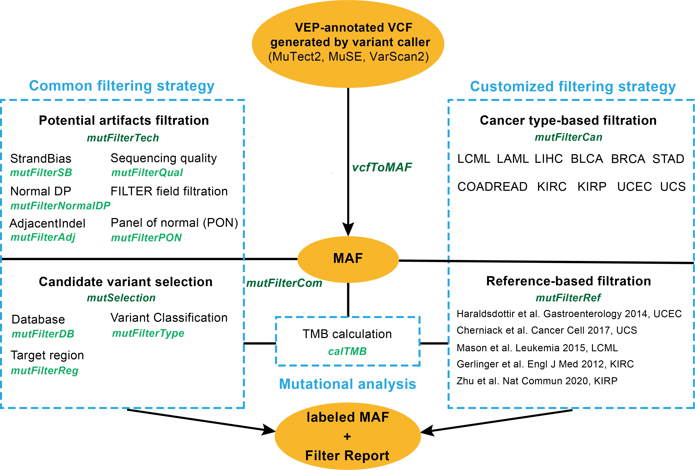

<style type="text/css">
  body{
  font-size: 11pt;
}
</style>


## 1. Introduction 

The quality control of cancer somatic mutations is of great significance in tumor genomics. It helps to eliminate false positive mutations arisen during the sequencing process, thereby improving the efficiency and accuracy of downstream analysis. Here, we developed an R package CaMutQC, for the quality control and selection of cancer somatic mutations. It offers both common and customized strategies of filtration for cancer somatic mutation based on the MAF data frame, which is able to select key mutations related to tumorigenesis. In addition, in order to avoid the bias of a single variant caller, The package, source code and documents are freely available through Github (https://github.com/likelet/CaMutQC)


### 1.1 Citation

In R console, enter `citation("CaMutQC")`.

&nbsp;


## 2. Input File 


### 2.1 Single VCF input

[VCF](https://samtools.github.io/hts-specs/VCFv4.3.pdf) is a widely used format in bioinformatics filed, it specifies the format of a text file used in bioinformatics for storing gene sequence variations. 

All VCF files should be annotated by [VEP](https://useast.ensembl.org/info/docs/tools/vep/index.html) first before analyzing through CaMutQC, because annotated VCF files contain more detailed information that has clinical significance. Information about VEP and how to run VEP on VCF file can be found at [here](https://asia.ensembl.org/info/docs/tools/vep/script/vep_options.html#opt_check_existing).


### 2.2 Multi-sample VCF input
CaMutQC supports annotated multi-sample VCF files as input, which should be under the same file path.


&nbsp;

## 3. Installation

### Via GitHub 

Install the latest version of this package by typing the commands below in R console:  
  
```{r eval=FALSE}
if (!requireNamespace("devtools", quietly = TRUE)) {
  install.packages("devtools")
}
devtools::install_github("likelet/CaMutQC")
```   

&nbsp;

## 4. Overview of CaMutQC

For now, there are three main functional modules in CaMutQC. The first section is to filter cancer somatic mutations through common strategies, and the following section offers users customized filtration criteria based on cancer types. And CaMutQC is capable of measuring TMB (Tumor Mutational Burden) through various methods. Input data of most functions in CaMutQC can be obtained by applying `vcfToMAF` function on certain VCF files.

MAF data frame with special labels from CaMutQC will be generated after each filtration. Besides, a filter report will be provided, which gives more detailed, organized and lively information. 





&nbsp;

## 5. From VCF to MAF

VCF and MAF both are important data format in oncology and bioinformatics, but the transformation between these two formats requires additional tool or software. `vcfToMAF` function in CaMutQC is able to perform this transformation using one line command just in a few seconds. In addition, parameter `filterGene` can filter variants without Hugo Symbol it is set as `TRUE`.

```{r, message=FALSE}
library(CaMutQC)
MAFdat <- vcfToMAF(system.file("extdata/Multi-sample", "SRR3670028.somatic.filter.HC.vep.vcf", package = "CaMutQC"))
MAFdat[1:5, 1:13]
```

Load multi-sample data that consists of several VCF files by setting `multiSample` as TRUE.

```{r, message=FALSE}
vcfPath <- system.file("extdata/Multi-sample", package = "CaMutQC")
multiVCF <- vcfToMAF(vcfPath, multiSample = TRUE)
unique(multiVCF$Tumor_Sample_Barcode)
```

&nbsp;


## 6. Common filtering strategies

After reading a number of related papers, we extracted, sorted and summarized some widely used parameters and their thresholds when performing cancer somatic mutation filtration. These strategies are implemented through a number of sub-functions that cover widely used criteria like sequencing quality, strand of bias and database selection. Each of the functions takes MAF data frame generated by `vcfToMAF` function in CaMutQC as input, then return a labeled MAF data frame reflecting corresponding filtration results.

Besides, sub-functions are integrated into bigger functions to provide more convenient filtration.

&nbsp;


### 6.1 Single filtration function


**Sub-functions and their corresponding flags**

| Main function | Sub-function | Flag |
| :----- | :---- | :---- |
| mutFilterTech | mutFilterQual | **Q** |
|  | mutFilterSB | **S** |
|  | mutFilterAdj | **A** |
|  | FILTER | **F** |
| mutSelection | mutFilterDB | **D** 
|  | mutFilterNormalDP | **N** |
|  | mutFilterPON | **P** |
|  | mutFilterType | **T** |
|  | mutFilterReg | **R** |
|  | mutFilterOnco | **C** |

**Note: A variant labeled with certain flag indicates it fails to pass this filter function, and all variants start with tag '0'**

&nbsp;

#### 6.1.1 Sequencing quality filtration

Sequencing quality parameters like `AD`, `DP` and `VAF` are basic indice to filter potential artifacts.

**Default thresholds for sequencing quality parameters**

- tumor depth (tumorDP): <span style="color:#ED6F3E">**20**</span>
- tumor allele depth (tumorAD): <span style="color:#ED6F3E">**10**</span>
- normal depth (normalDP): <span style="color:#ED6F3E">**10**</span>
- VAF: <span style="color:#ED6F3E">**0.05**</span>
- VAF ratio (tumorVAF/normalVAF): <span style="color:#ED6F3E">**5**</span>


```{r, message=FALSE}
table(MAFdat$CaTag)
MAF_qual <- mutFilterQual(MAFdat, VAF = 0.01, VAFratio = 4)
table(MAF_qual$CaTag)
```

&nbsp;

#### 6.1.2 Strand of Bias filtration

Strand bias occurs when the genotype inferred from information presented by the forward strand and the reverse strand disagrees. A study showed that post-analysis procedures can cause strand bias, which introduce more SNPs with higher strand bias, and in turn results in more false-positive SNPs [1](#refer). Therefore, it is necessary to detect and minimize the strand bias of our data.

At present, there are four methods of strand bias detection that are widely used. In a mitochondria heteroplasmy study [2](#refer), the calculation of SB was put forward. GATK calculates a strand bias score for each SNP identified, and Samtools also computes a strand bias score based on Fisher's exact test. Additionally, GATK introduced an updated form of the Fisher Strand Test, [StrandOddsRatioSOR](https://gatk.broadinstitute.org/hc/en-us/articles/360041849111-StrandOddsRatio) annotation (SOR), which is believed to be better at measuring strand bias for data in high coverage.

In CaMutQC, either Fisher Strand Test or SOR algorithm can be used to evaluate strand bias and filter variants based on the results. By default, strand bias is detected through SOR algorithm, and the cutoff for strand of bias score is set as 3.

```{r, message=FALSE}
MAF_sb <- mutFilterSB(MAFdat, SBscore = 2)
table(MAF_sb$CaTag)
```

&nbsp;

#### 6.1.3 Adjacent indel tag filtration

The Adjacent Indel tag is used when a somatic variant was possibly caused by misalignment around a germline or somatic insertion/deletion(indel). By default, CaMutQC will filter any SNV which that was within 10bp of an indel found in the tumor sample. Also, the maximum length of an indel is set as 50bp.

```{r, message=FALSE}
MAF_adj <- mutFilterAdj(MAFdat, maxIndelLen = 40, minInterval = 15)
table(MAF_adj$CaTag)
```

&nbsp;

#### 6.1.4 Database filtration

Some database published germline variants and recurrent artifacts in distinct races. In CaMutQC, based on the parameters we collected [3](#refer) [4](#refer) [5](#refer), potential germline variants will be removed using annotation from those database(if available) unless the allele frequency of a mutation is lower than the VAF threshold (0.01) or CliVar/OMIM/HGMD flags it as pathogenic.

[COSMIC](https://cancer.sanger.ac.uk/cosmic/), the Catalogue Of Somatic Mutations In Cancer, is the world's largest and most comprehensive resource for exploring the impact of somatic mutations in human cancer. They have assembled a list of genes that are somatically mutated and causally implicated in human cancer [6](#refer), which is called the The Cancer Gene Census and is updated periodically with new genes. In VCF files annotated by VEP, a `Existing_variation` column normally indicates a gene is on this COSMIC list if it has a annotation ID starts with `COSV`, `COSM` or `COSN`. 

By default, CaMutQC filters variants recorded in **ExAC**, **Genomesprojects1000**, **ESP6500** and **gnomAD**, and only keeps variants in **COSMIC**.

```{r, message=FALSE}
MAF_db <- mutFilterDB(MAFdat, dbSNP = TRUE, COSMIConly = FALSE)
table(MAF_db$CaTag)
```

&nbsp;

#### 6.1.5 Normal depth filtration

To avoid miscalling germline variants and to ensure the quality of variants [4](#refer), CaMutQC supports filtration on normal depth for both dbsnp/non-dbsnp variants. Cutoffs are 19 and 8 respectively. 

```{r, message=FALSE}
MAF_normaldp <- mutFilterNormalDP(MAFdat)
table(MAF_normaldp$CaTag)
```

&nbsp;

#### 6.1.6 Panel of Normals filtration 

Panel of Normals or PON is a type of resource used in somatic variant analysis. Basically, if a variant is found in a panel of normals, or is found in more than two normal samples, it is unlikely to be a driven variant during cancer development. PON filtration has been widely used in many researches and projects to discard non-driven variants [3](#refer) [7](#refer)
[8](#refer).

A PON can be generated by users through sequencing a number of normal samples that are as technically similar as possible to the tumor (same exome or genome preparation methods, sequencing technology and so on). Or, a PON can be directly obtained from GATK, which is viewed as one of the most effective filters of false-positive, contamination, and germline variants filter [4](#refer).

In CaMutQC, PON filtration dependents on GATK PON datasets, and variant data refers to different versions of genome uses different public GATK panels of normals dataset for filtration.

For GRCh37, panel of normals dataset is `inst/extdata/PON/somatic-b37_Mutect2-exome-panel.vcf`, and panel of normals dataset is `inst/extdata/PON/somatic-hg38_1000g_pon.hg38.vcf` for data built on GRCh38.

```{r, message=FALSE}
MAF_pon <- mutFilterPON(MAFdat)
table(MAF_pon$CaTag)
```

&nbsp;

#### 6.1.7 Variant type filtration

Most studies relate to cancer somatic mutations keep certain types of variants in order to better target candidate variants, among which **`exonic`** and **`nonsynonymous`** are two of the most widely used categories for filtration [4](#refer) [9](#refer) [10](#refer).

In CaMutQC, two categories can be chosen during this filtration step. **`exonic`** is the default option, and the other option is **`nonsynonymous`**, it will leave you non-synonymous variants. More details could be found at [Ensembl Variation](https://m.ensembl.org/info/genome/variation/prediction/predicted_data.html) and [Variant Classification Description](http://uswest.ensembl.org/Help/Glossary?id=535).

- Variant classifications filtered when set as exonic: **`RNA`, `Intron`, `IGR`, `5\'Flank`, `3\'Flank`, `5\'UTR`, `3\'UTR`**

- Variant classifications filtered when set as nonsynonymous: **`3'UTR`, `5\'UTR`, `3\'Flank`, `Targeted_Region`, `Silent`, `Intron`, `RNA`, `IGR`, `Splice_Region`, `5\'Flank`, `lincRNA`,`De_novo_Start_InFrame`, `De_novo_Start_OutOfFrame`, `Start_Codon_Ins`, `Start_Codon_SNP`, `Stop_Codon_Del`**

```{r, message=FALSE}
MAF_type <- mutFilterType(MAFdat, keepType = 'nonsynonymous')
table(MAF_type$CaTag)
table(MAF_type$Variant_Classification[which(MAF_type$CaTag == '0')])
```

&nbsp;

#### 6.1.8 Region selection

In this section, users are able to further select variants related to cancer development by providing a BED file. Variants will be searched only in target regions. Besides, parameter `bedFilter` can be set as `TRUE` to clean the bed file.

```{r, message=FALSE}
MAF_reg <- mutFilterReg(MAFdat, bedFile = system.file("extdata/bed/panel_hg19", "hg19_FlCDx.bed", package = "CaMutQC"))
table(MAF_reg$CaTag)
```

&nbsp;

### 6.2 Overall filtration

sub-functions above are divided into two groups according to their definitions and the categories they belongs to, which can be controlled through function `mutFilterTech` and `mutSelection` respectively. Each function is composed of more than one sub-functions that apply filtration variants from different aspects but the same category. After passing through a filter function, each variant may be labeled with more than one flag that reflect the filtration results.

In addition, `mutFilterCom` function is an upper function that combine `mutFilterTech` and `mutSelection`. Any Parameters in all sub-functions can be set in `mutFilterCom` function.

&nbsp;

#### 6.2.1 Potential artifacts filtration

Function `mutFilterTech` combines filtration strategies for potential artifacts, including sequencing quality, strand of bias and adjacent indel filtration.

Some variant callers add a tag if a variant pass the post-filtration after calling. In CaMutQC, users can set a standard tag found in the FILTER column of VCF file to keep variants. `PASS` is used in CaMutQC by default.

```{r, message=FALSE}
MAF_tech <- mutFilterTech(MAFdat, tumorDP = 8, minInterval = 9, tagFILTER = NULL)
table(MAF_tech$CaTag)
```

&nbsp;

#### 6.2.2 Candidate variant selection

In most cases, basic filtration by removing potential artifacts is not enough for selecting candidate variants that participate in the formation and growth of cancer, for a number of germline variants or variants that do not impact any phenotype will be kept. Therefore, candidate variant selection is a necessary step for following analyses.

In CaMutQC, the whole selection process is comprised of database filtration, normal depth filtration, PON filtration, variant type filtration and region selection, which integrates in function `mutSelection`.

```{r, message=FALSE}
MAF_selec <- mutSelection(MAFdat, dbVAF = 0.02, gnomAD = FALSE, keepType = 'nonsynonymous')
table(MAF_selec$CaTag)
```

&nbsp;

#### 6.2.3 Combined function: mutFilerCom

A main function of CaMutQC is `mutFilterCom`, which integrates all single functions and their parameters into a big function. In addition, it provides other information and function that makes CaMutQC an interactive and powerful tool.

```{r, message=FALSE}
MAFCom <- mutFilterCom(MAFdat, report = FALSE, TMB = FALSE)
table(MAFCom$CaTag)
```

&nbsp;

##### 6.2.3.1 Filter report

By default, a vivid and detailed filter report will be saved automatically each time after running `mutFilterCom`. An example filter report can be found at...

&nbsp;

##### 6.2.3.2 TMB calculation

`mutFilterCom` also support the calculation of TMB. Details about TMB can be found at [Mutational analysis](#tmb) section.

```{r, message=FALSE}
MAFCom_tmb <- mutFilterCom(MAFdat, report = FALSE, TMB = TRUE, bedFile = system.file("extdata/bed", "Twist_Exome_Target_hg19.bed", package = "CaMutQC"))
table(MAFCom_tmb$CaTag)
```

&nbsp;

## 7. Customized filtering strategies

In CaMutQC, users are able to filter and select cancer somatic mutations according to cancer types, where thresholds for parameters all come from classical studies. `mutFilterCan` function integrates 10 cancer types so far, with different parameters for each cancer type, for a more precise and customized filtration. 

Cancer types supported in CaMutQC: **COADREAD**, **BRCA**, **LIHC**, **LAML**, **LCML**, **UCEC**, **UCS**, **BLCA**, **KIRC** and **KIRP**.

```{r, message=FALSE}
MAFCan <- mutFilterCan(MAFdat, cancerType = 'LAML', report = FALSE, TMB = FALSE)
table(MAFCan$CaTag)
```

&nbsp;

## 8. Mutational analysis {#tmb}

Tumor Mutational Burden (TMB) refers to the number of somatic non-synonymous mutations per megabase pair (Mb) in a specific genomic region. In 2015, tumor non-synonymous mutation burden was first confirmed to be related to PD1/PD-L1 cancer immunotherapy [11](#refer). Through the analysis of mutation burden of patients with non-small cell lung cancer, the clinical response and survival rate and other indicators, researchers confirmed that the higher the TMB of cancer patients have, the better the effect of tumor immunotherapy would get. This conclusion was subsequently verified in other cancer types, such as malignant melanoma [12](#refer) and small cell lung cancer [13](#refer). Therefore, TMB has become one of the predictive biomarkers of immune checkpoint and inhibitor immunotherapy in cancer treatment [14](#refer).

There are many calculation methods for TMB, including WGS, WES, regional sequencing using gene panels, and sequencing of circulating tumor DNA in tumor samples or blood [15](#refer). Different from scientific research, the conventional method of determining TMB in clinical practice is to target-sequence tumor samples, which is to hybridize and capture the exon and intron regions of a certain number of cancer-related genes, without the need for WES sequencing. Currently, the most widely used panels are [FoundationOneCDx](https://www.foundationmedicine.com/test/foundationone-cdx) (F1CDx) and [MSK-IMPACT](https://www.mskcc.org/msk-impact) [9](#refer). The former only needs to sequence tumor samples, while the latter requires both the tumor sample and its matched normal sample to be sequenced. Both of them have certification from US Food and Drug Administration (FDA).

In CaMutQC, four methods are supported for TMB calculation, including FoundationOne, MSK-IMPACT (3 versions of genelist), Pan-cancer panel [16](#refer) and WES. By default, TMB is calculated using MSK-IMPACT method (gene panel version 3, 468 genes). Also, users are free to apply their own methods by setting parameter `assay` as `Customized`.

```{r, message=FALSE}
tmb_value <- calTMB(MAFdat, bedFile = system.file("extdata/bed/panel_hg19", "hg19_MSK_341.bed", package = "CaMutQC"), assay = 'MSK-v1')
tmb_value
```

&nbsp;


## 9. Combine CaMutQC filtered multi-callers mutations

We believed combining CaMutQC filtered mutations called by multiple callers is a great approach to better eliminate the bias of single mutation caller, as well as to rescue potential false negative mutations. In this pipeline, the same dataset processed by three mutation callers ([MuTect2](https://gatk.broadinstitute.org/hc/en-us/articles/360037593851-Mutect2), [VarScan](http://varscan.sourceforge.net/) and [MuSE](http://bioinformatics.mdanderson.org/main/MuSE)) will go through CaMutQC filtration repectively, then `combineMut` function takes three MAF data frames and return the union of mutations.


&nbsp;

## 10. SessionInfo

```{r}
sessionInfo()
```

&nbsp;

## 11. Reference {#refer}

&nbsp;

1. Guo Y, Li J, Li CI, Long J, Samuels DC, Shyr Y. The effect of strand bias in Illumina short-read sequencing data. BMC Genomics. 2012;13:666. Published 2012 Nov 24. doi:10.1186/1471-2164-13-666

2. Guo Y, Cai Q, Samuels DC, et al. The use of next generation sequencing technology to study the effect of radiation therapy on mitochondrial DNA mutation. Mutat Res. 2012;744(2):154-160. doi:10.1016/j.mrgentox.2012.02.006

3. Pereira B, Chin SF, Rueda OM, et al. The somatic mutation profiles of 2,433 breast cancers refines their genomic and transcriptomic landscapes. Nat Commun. 2016;7:11479. Published 2016 May 10. doi:10.1038/ncomms11479

4. Ellrott K, Bailey MH, Saksena G, et al. Scalable Open Science Approach for Mutation Calling of Tumor Exomes Using Multiple Genomic Pipelines. Cell Syst. 2018;6(3):271-281.e7. doi:10.1016/j.cels.2018.03.002

5. Xue R, Chen L, Zhang C, et al. Genomic and Transcriptomic Profiling of Combined Hepatocellular and Intrahepatic Cholangiocarcinoma Reveals Distinct Molecular Subtypes. Cancer Cell. 2019;35(6):932-947.e8. doi:10.1016/j.ccell.2019.04.007

6. Futreal PA, Coin L, Marshall M, et al. A census of human cancer genes. Nat Rev Cancer. 2004;4(3):177-183. doi:10.1038/nrc1299

7. Brastianos PK, Carter SL, Santagata S, et al. Genomic Characterization of Brain Metastases Reveals Branched Evolution and Potential Therapeutic Targets. Cancer Discov. 2015;5(11):1164-1177. doi:10.1158/2159-8290.CD-15-0369

8. Sethi NS, Kikuchi O, Duronio GN, et al. Early TP53 alterations engage environmental exposures to promote gastric premalignancy in an integrative mouse model. Nat Genet. 2020;52(2):219-230. doi:10.1038/s41588-019-0574-9

9. Cheng DT, Mitchell TN, Zehir A, et al. Memorial Sloan Kettering-Integrated Mutation Profiling of Actionable Cancer Targets (MSK-IMPACT): A Hybridization Capture-Based Next-Generation Sequencing Clinical Assay for Solid Tumor Molecular Oncology. J Mol Diagn. 2015;17(3):251-264. doi:10.1016/j.jmoldx.2014.12.006

10. Sakamoto H, Attiyeh MA, Gerold JM, et al. The Evolutionary Origins of Recurrent Pancreatic Cancer. Cancer Discov. 2020;10(6):792-805. doi:10.1158/2159-8290.CD-19-1508

11. Rizvi NA, Hellmann MD, Snyder A, et al. Cancer immunology. Mutational landscape determines sensitivity to PD-1 blockade in non-small cell lung cancer. Science. 2015;348(6230):124-128. doi:10.1126/science.aaa1348

12. Snyder A, Makarov V, Merghoub T, et al. Genetic basis for clinical response to CTLA-4 blockade in melanoma [published correction appears in N Engl J Med. 2018 Nov 29;379(22):2185]. N Engl J Med. 2014;371(23):2189-2199. doi:10.1056/NEJMoa1406498

13. Hellmann MD, Callahan MK, Awad MM, et al. Tumor Mutational Burden and Efficacy of Nivolumab Monotherapy and in Combination with Ipilimumab in Small-Cell Lung Cancer [published correction appears in Cancer Cell. 2019 Feb 11;35(2):329]. Cancer Cell. 2018;33(5):853-861.e4. doi:10.1016/j.ccell.2018.04.001

14. Lee M, Samstein RM, Valero C, Chan TA, Morris LGT. Tumor mutational burden as a predictive biomarker for checkpoint inhibitor immunotherapy. Hum Vaccin Immunother. 2020;16(1):112-115. doi:10.1080/21645515.2019.1631136

15. Stenzinger A, Allen JD, Maas J, et al. Tumor mutational burden standardization initiatives: Recommendations for consistent tumor mutational burden assessment in clinical samples to guide immunotherapy treatment decisions. Genes Chromosomes Cancer. 2019;58(8):578-588. doi:10.1002/gcc.22733

16. Xu Z, Dai J, Wang D, et al. Assessment of tumor mutation burden calculation from gene panel sequencing data. Onco Targets Ther. 2019;12:3401-3409. Published 2019 May 6. doi:10.2147/OTT.S196638


